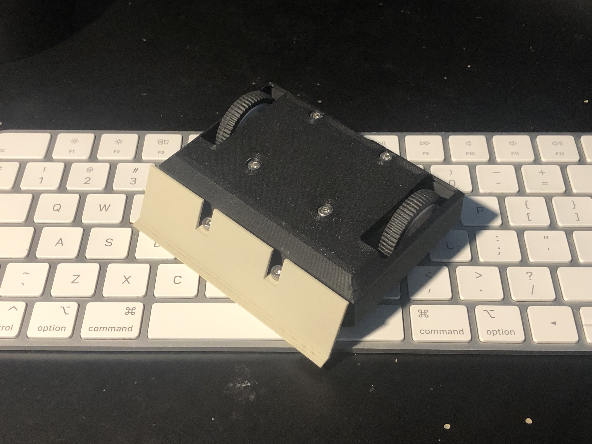
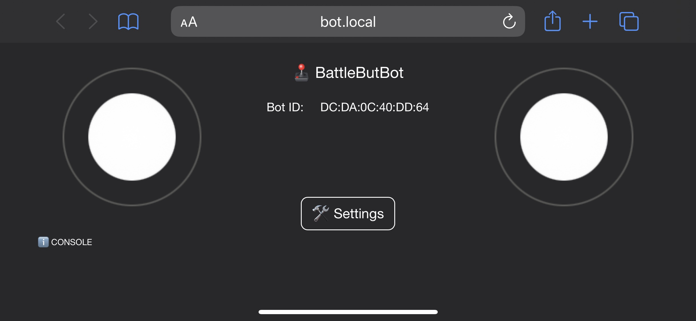
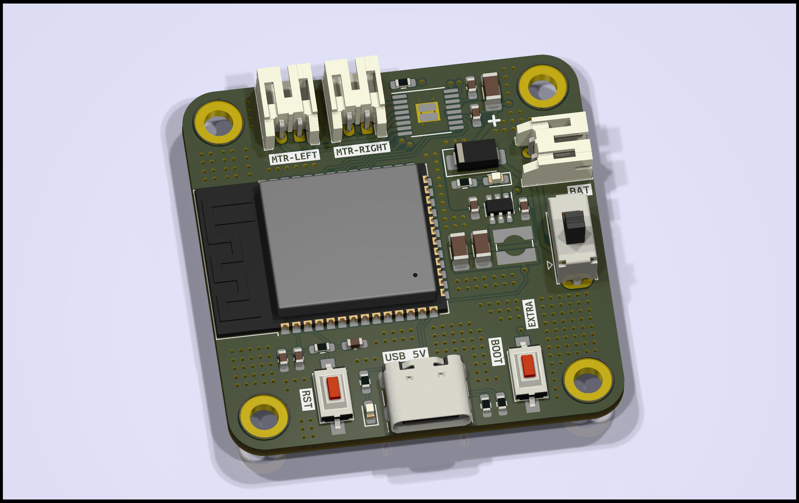
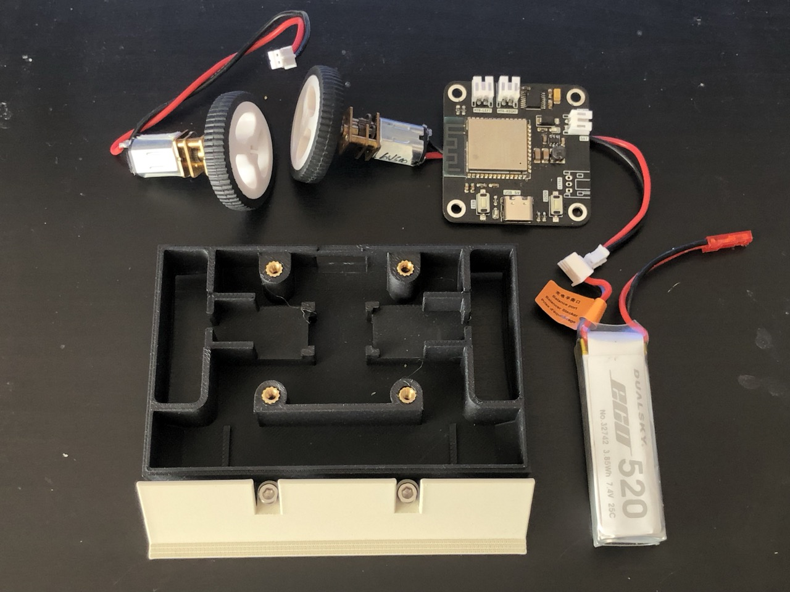
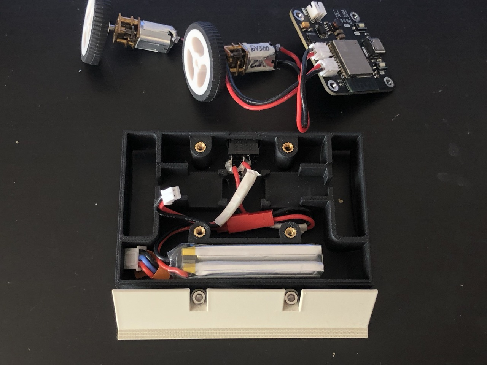
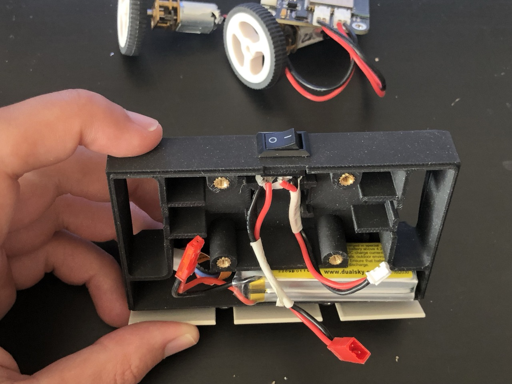
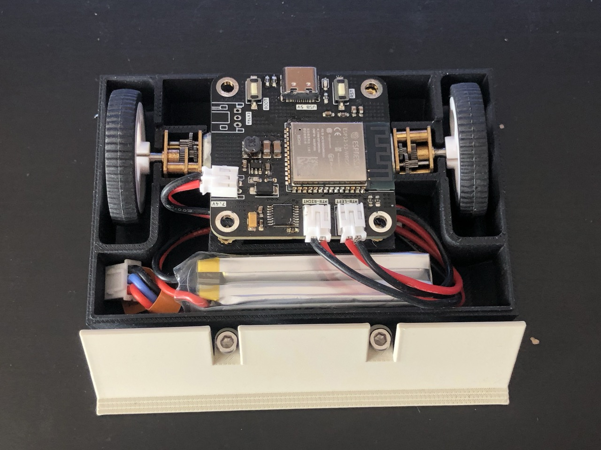

# BattleButBot: Your Ultimate Antweight Pusher Robot Companion

BattleButBot is a small (<10x8cm) and light (<150g) robot designed specifically for the [Antweight class of robot combat events](https://www.robotwars101.org/ants/rules.htm). With its sleek design, sturdy construction, and advanced control features, BattleButBot is the perfect choice for robot fighting enthusiasts of all skill levels.



## Features

* **Intuitive Web-based Control**: BattleButBot can be easily controlled from any device with a [web browser](#web-robot-controller), allowing you to take full control of your robot in real-time.
* **Powerful Motors**: BattleButBot's brush DC motors provide great performance and speed, allowing your robot to deliver powerful moves.
* **Durable Build**: BattleButBot is built to withstand the toughest battles in Antweight robot combat events. Its rugged construction and impact-resistant design ensure that your robot stays in one piece, no matter how intense the fight gets.
* **Easy to Use**: BattleButBot is easy to use and requires no special skills or training. With its intuitive controls and simple setup process, you can start battling right away.

🎉 **NEW**: The BattleButBot supports [ESPNow](https://www.espressif.com/en/solutions/low-power-solutions/esp-now) protocol, thus provinding another way to be externally controlled. Check the [simple esp-now controller](https://github.com/nguterresn/simple-esp-now-controller) to know more.

## Requirements

**Cheap**: Priced under $50

* ✅ Costs 50$.

**Weight**: Equal or less than 150 milligrams

* ✅ Weigths ~110g. (PLA printed)

**Acessable**: All parts are easily available (can be obtained from anywhere)

* ✅ Parts can be found on [LCSC](lcsc.com), [Digikey](digikey.com) or [AliExpress](https://www.aliexpress.us).

**Flexible**: Can be controlled over WiFi

* ✅ Easy to use web browser GUI

**Simple**: All hardware components are easy to assemble

* ✅ The device uses [PH sockets](https://www.jst-mfg.com/product/index.php?series=199) and requires a few screws.

**Portable**: Powered by a lithium battery

* ✅ Small and light weight 2S 7.4V battery (58 x 18 x 19 mm).

## Web Robot Controller

Connect to the `BattleButBot` network using WiFi.


Open `bot.local` on you browser.



To control the BattleButBot, simply use both **joysticks** located in the screen.

> [!NOTE]
> Before submitting a issue ticket, please use another browser as Safari is not 100% stable for a web browser controller.

## ESPNow Controller

Take a look [here](https://github.com/nguterresn/simple-esp-now-controller).

### Robot Controls

You can control BattleButBot using the joysticks from the graphical user interface (GUI). To move forward, drag the left joystick upwards, and to move backward, drag the left joystick downwards. To lean the BattleButBot to the right, drag the right joystick to the right and vice-versa.

### Settings

To configure your joystick settings, click the `Settings` button.

For ease of development while the robot firmware is in development, a console log is located at the bottom of the screen.

## How to order

### Shopping list:

| Hardware                                                                                                                                                                                                                                                                                                                                                                                                                                                        | Qty | Price                           |
| --------------------------------------------------------------------------------------------------------------------------------------------------------------------------------------------------------------------------------------------------------------------------------------------------------------------------------------------------------------------------------------------------------------------------------------------------------------- | --- | ------------------------------- |
| [N20 Gear Motor 6V 600RPM](https://www.aliexpress.us/item/3256803245120861.html?spm=a2g0o.productlist.main.3.be16dmKLdmKLdh&algo_pvid=1b8b9a20-a58e-4537-a37a-af46f9d1652b&algo_exp_id=1b8b9a20-a58e-4537-a37a-af46f9d1652b-1&pdp_npi=4%40dis%21SEK%2125.63%2119.17%21%21%212.34%211.75%21%40211b61a417119945526086789eb5a6%2112000025761667070%21sea%21SE%210%21AB&curPageLogUid=N7UsGzjkJw8d&utparam-url=scene%3Asearch%7Cquery_from%3A&gatewayAdapt=glo2usa) | 2   | 1.36$ x 2 + 2.27$ shipping      |
| [Wheels](https://www.aliexpress.com/item/33026783171.html?spm=a2g0o.order_list.order_list_main.102.76381802470tYv)                                                                                                                                                                                                                                                                                                                                              | 2   | ~1$ + 4$ shipping               |
| [BOM](https://github.com/nguterresn/battlebutbot/blob/main/board/bubblebutbot/jlcpcb/production_files/BOM-bubblebutbot.csv)                                                                                                                                                                                                                                                                                                                                     | 1   | ~10$ + 10$ [shipping](LCSC.com) |
| [PCB](https://github.com/nguterresn/battlebutbot/blob/main/board/bubblebutbot/jlcpcb/production_files/GERBER-bubblebutbot.zip)                                                                                                                                                                                                                                                                                                                                  | 5   | ~2$ + 3$ [shipping](jlcpcb.com) |
| [2S LiPo](https://botland.store/battery-li-pol-2s-74-v/570-li-poly-dualsky-520mah-25c-2s-74v-6941047107427.html)                                                                                                                                                                                                                                                                                                                                                | 1   | 8$                              |
| Total                                                                                                                                                                                                                                                                                                                                                                                                                                                           | -   | ~50$                            |

When ordering the BOM, make sure to order at least 5 (five!) of each component so you end up with the possibility to solder 5 different PCBs.

### Supply chain troubleshooting

⚠️ In case a few componenets are not available refer to the list below:

- Any ESP32-S3-WROOM-1 (NOT 1U!) should work. There are a [few variations](https://www.lcsc.com/search?q=ESP32-S3-WROOM-1) of the same footprint with more or less RAM and FLASH.
- H1-H4 componenets are mount holes, they don't need any component assigned.
- In case of resistor or capacitors shortage, it is also OK to find other supplier as long as it follows the same specification (e.g. 20k resistor 5%)

## Design

The design of the BattleButBot plays an important role. How it is designed determines how heavy (or how light) it is. Two requirements: sturdy and light.



### Cyberpunk

A cyberpunk alike robot is cold as hell. The low poly edges also make it easier to print.

## Assemble

What you need:

* 6 M3 8mm/5mm screws
* 6 Heat inserts
* The [body](https://github.com/nguterresn/battlebutbot/blob/main/body/Car.stl)
* The [lid](https://github.com/nguterresn/battlebutbot/blob/main/body/Lid.stl)
* The [front](https://github.com/nguterresn/battlebutbot/blob/main/body/Gate.stl)
* A 2S-7.4V Lithium battery
* The [PCB](https://github.com/nguterresn/battlebutbot/tree/main/board/bubblebutbot)
* The two wheels



### Battery

Place the battery close to the front of the bot.



Place the switch.



### Motors

Place both motors with the gears facing the top (to prevent any friction with the bottom).

### PCB

Before screwing the PCB down, finish all the connections.



Place the PCB and the lid, and screw it down.

## Develop

Clone the project by running the following command:

```bash
git clone git@github.com:nguterresn/battlebutbot.git
```

### Tools

* VSCode with PlatformIO
* Fusion360

### 3rd Party Libraries

* [ESPAsyncWebServer](https://github.com/me-no-dev/ESPAsyncWebServer)
* [Joystick 2](https://github.com/bobboteck/JoyStick)

## Support

If you have any questions or issues with the BattleButBot, please contact guterresnogueira@gmail.com.
